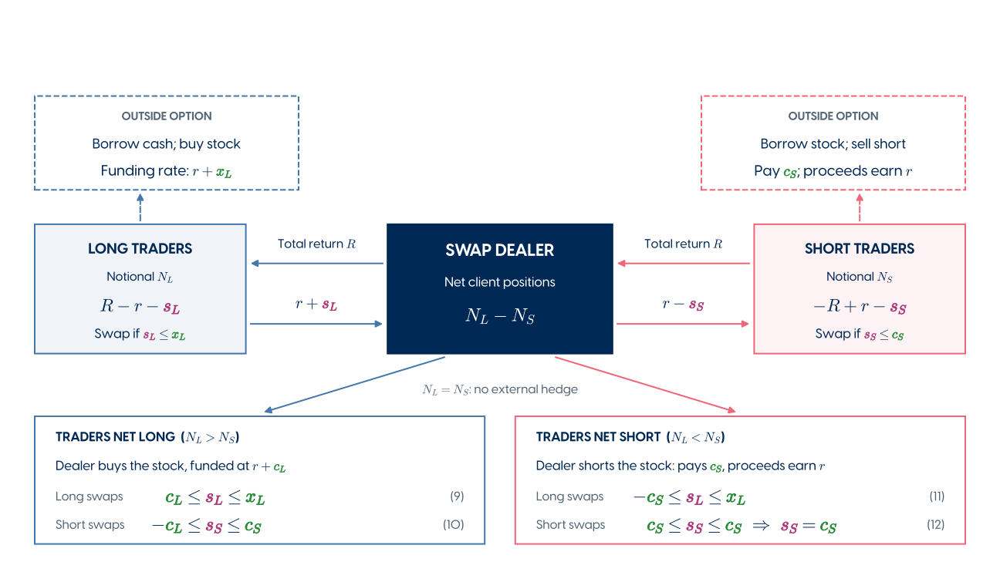
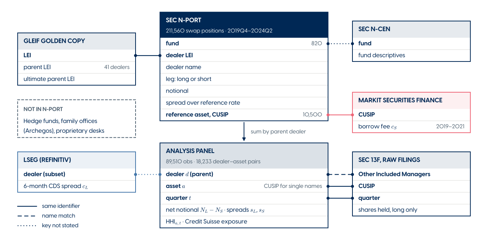

## The Paper {#the-paper .intro-slide}

::: {.intro-points}
- Derives [equilibrium spreads]{.term-spread} in a static swap market where the dealer
  **nets opposing client trades** and **hedges the residual**.
- Concludes that [net long]{.term-long} and [net short]{.term-short} demand are priced
  differently: spreads reflect a [[dealer-specific]{.nowrap} funding cost]{.term-cost} and an
  [[asset-specific]{.nowrap} borrowing cost]{.term-cost}, respectively.
- Tests the **pricing, hedging and competition** predictions on [contract-level]{.nowrap}
  spreads and dealer positions.
- Introduces a relatively recent dataset: funds' swap holdings from **SEC Form N-PORT**, with
  each contract's spread and dealer.
:::

## How the TRS market works {#trs-market}

::: {.figure-zoom data-extent="18 10.125"}
{fig-alt="Schematic of the equity total return swap market"}

[]{.zoom-step .fragment data-view="0.30 2.76 11.08 8.82"}
[]{.zoom-step .fragment data-view="6.93 2.72 18.00 8.95"}
[]{.zoom-step .fragment data-view="0.50 0.25 17.50 9.80" data-keep="6.93 3.62 11.07 6.22; 0.45 0.20 17.55 3.70"}
:::

## How dealers price leverage {#paper .paper-slide}

+----------------------------+----------------------------------------------------------------------------+
| Idea                       | Result                                                                     |
+============================+============================================================================+
| Spread sensitivity         | In stocks intermediated by **many dealers**, spreads track the [dealer's   |
|                            | funding cost]{.term-cost} under [net long]{.term-long} demand and the      |
|                            | [stock's borrowing cost]{.term-cost} under [net short]{.term-short}        |
|                            | demand.                                                                    |
+----------------------------+----------------------------------------------------------------------------+
| Spreads and net exposure   | Spreads show a [significant discontinuity]{.term-spread} where **net       |
|                            | exposure changes sign**.                                                   |
+----------------------------+----------------------------------------------------------------------------+
| Internal hedging           | Dealers quote [lower spreads]{.term-spread} to new counterparties when the |
|                            | trade **offsets their net exposure**.                                      |
+----------------------------+----------------------------------------------------------------------------+
| Marginal hedging           | Dealers' **13F stock holdings** track their **residual positions**.        |
+----------------------------+----------------------------------------------------------------------------+
| Competition                | - Spreads lie closer to [funding and borrowing costs]{.term-cost} where    |
|                            |   **competition is strong**.                                               |
|                            | - After **Credit Suisse's exit**, [spreads rise]{.term-spread} where       |
|                            |   competition weakens.                                                     |
+----------------------------+----------------------------------------------------------------------------+

::: {.takeaway .fragment .unfold}
**Caveat.** These are cross-sectional patterns that **explain little** of the observed
[variation in spreads]{.term-spread}. Where R^2^s are high, they come from **fixed effects**;
**within R^2^s** would show how much the mechanism itself explains.
:::

## The data schema {#data-schema}

{fig-alt="Data sources and how they are matched into the analysis panel"}

## N-PORT: relatively new, "incomplete" dataset {#nport .nport-slide}

:::: {.columns}
::: {.column width="100%"}
### Dataset's history
:::
::::
:::: {.nport-timeline}
::: {.event}
[2016]{.when}
Rules adopted
:::

::: {.event}
[Late 2019]{.when}
Public XML filings on EDGAR
:::

::: {.event}
[2020]{.when}
Smaller fund groups enter
:::

::: {.event}
[July 2024]{.when}
**Easy to download** complete history
:::
::::

:::: {.columns}
::: {.column width="37%"}
### What's new in N-PORT?

**Before:**

- holdings in N-Q / N-CSR;
- no unified handling of swaps.

**Now:** standardized contracts: **financing terms, notional, underlying, dealer**.
:::

::: {.column width="58%"}
### Coverage--how big is the TRS market?

| | Size | Scope |
|:----|---:|:-----------------|
| **N-PORT** | **$0.38tn** | Equity swap notional in Q2 2026 |
| **SEC** | **$3.33tn** | Equity TRS with a US connection, excl. broad indices |
| **BIS** | **$6.30tn** | Global equity swap and fwd market |

[SEC and BIS: December 2025.]{.muted}

**N-PORT / SEC = 11.3%, N-PORT / BIS = 6.0%.**
:::
::::

:::: {.takeaway .missing-clients .fragment .unfold}
**Missing hedge funds, family offices and prop desks → how representative is dealer net exposure?**[]{.fragment .alarm-switch}

::: {.alarm}
**Missing hedge funds, family offices and prop desks → why does this even work?!**
:::
::::

::: {.smaller .muted}
Sources: [SEC reform](https://www.sec.gov/rules/final/2016/33-10231.pdf), [reporting timeline](https://www.sec.gov/rules-regulations/staff-guidance/investment-company-reporting-modernization-frequently-asked-questions), [bulk-data launch](https://www.sec.gov/newsroom/whats-new/2407-form-nport-data-sets); own N-PORT calculation; [SEC Table D.1](https://www.sec.gov/files/tm/report-security-based-swaps-062626.pdf); [BIS](https://data.bis.org/topics/OTC_DER/BIS,WS_OTC_DERIV2,1.0/H.A.C.E.5J.A.5J.A.TO1.TO1.A.A.3.C).
:::

## Strong qualitative support for theory—despite incomplete coverage {#separate-books .separate-books-slide}

Could registered funds trade with [**separate dealer books**]{.tol-blue}?  
N-PORT might capture the **relevant** inventory.

### Anecdotal evidence...
| In support | Against |
|:--|:--|
| Banks separate trading desks by **product and geography**. | **No established separation** between registered funds and hedge funds. |
| [Desk-specific constraints]{.term-cost} could shape quotes. | **Shared inventory** and [internal funding]{.term-cost} connect desks. |
| | Invesco describes hedge-fund demand [improving ETF swap pricing]{.term-spread}.* |

::: {.takeaway .fragment .unfold}
The central concern is about the **sign of net demand**.
:::

::: {.smaller .muted}
*Invesco example: European synthetic ETFs / China exposure. Sources:
[CS](https://www.sec.gov/Archives/edgar/data/1053092/000137036822000019/cs-20211231.htm),
[UBS](https://www.sec.gov/Archives/edgar/data/230611/000183988224033103/xslATS-N_X01/primary_doc.xml),
[BofA](https://www.islaamericas.org/isla-events/isla-americas-2nd-annual-securities-finance-collateral-management-conference/speakers/),
[Invesco, p. 4](https://www.invesco.com/content/dam/invesco/emea/en/pdf/why-structure-matters-when-choosing-an-ETF-retail.pdf).
:::

## N-PORT, 2026 Q2: underlying assets {#nport-underlyings .underlyings-slide}

::: {.lead}
Single stocks are 89% of positions but 22%
of gross notional; indices and baskets more economically important at 71%.
:::

| Underlying | Positions | Gross | Fund long | Fund short | Unresolved | Net demand |
|:--|--:|--:|--:|--:|--:|--:|
| Indices / baskets | 2,869 | 269.0 | 225.2 | 35.1 | 8.6 | 190.0 |
| Other ETFs | 617 | 22.9 | 18.9 | 3.6 | 0.5 | 15.3 |
| Single-name stocks | 29,509 | 83.8 | 65.1 | 11.3 | 7.4 | 53.8 |
| Unclassified / other | 97 | 0.9 | 0.2 | 0.2 | 0.5 | 0.0 |
| **All** | **33,092** | **376.5** | **309.3** | **50.2** | **17.0** | **259.1** |

::: {.smaller .muted}
Notional in \$bn. Data from 2026 Q2, 1,120 funds reporting between
February and April 2026. Data source: [SEC N-PORT data](https://www.sec.gov/data-research/sec-markets-data/form-n-port-data-sets),
[Form N-PORT](https://www.sec.gov/files/formn-port.pdf); own calculation.
:::

## Request for more granular evidence {#index-lab .index-lab-slide}

::: {.lab-point}
**Benchmark index swaps can be hedged with futures (dealer chars don't matter)**

- Futures margin: a **very low %** of notional--cheap leverage
- → the [futures basis]{.term-cost} should price them rather than the dealer's own [CDS]{.term-cost}
- Paper's §3.3 bounds (eqs. 9–12): ½$(c_L+c_S)$ ≤ [jump]{.term-spread} ≤ $c_L+c_S$ → with
  futures, [**≤ the bid–ask**]{.nowrap}
:::

::: {.lab-point .fragment}
**Additional tests with futures-hedgeable indices**

- **Table 2** · jump in spreads when [net demand crosses zero]{.term-long} → the
  [discontinuity almost vanishes]{.term-spread} for indices hedged with futures
- **Table 3** · pass-through of dealer funding costs → add the [futures basis]{.term-cost}
  alongside dealer [CDS]{.term-cost}; the basis should [**win the horse race**]{.nowrap}
- **Table 4** · discount on [offsetting trades]{.term-long} → a
  [smaller discount]{.term-spread} for index swaps
- **Table 5** · dealer hedging in 13F holdings → futures **aren't reported in 13F**, so
  pass-through could be zero, unless dealers hedge with ETFs
- Use indices **without futures** as a control group
:::

::: {.lab-point .fragment}
**Additional tests**

- **Hedge-cost ladder:** hard-to-borrow → easy-to-borrow stocks → ETFs → indices; we should see effects **shrink**
- **Table 2: compare dealers serving both long and short clients** in the same asset.
  Does the [spread difference]{.term-spread} between [net long]{.term-long} and
  [net short]{.term-short} demand persist with [asset × quarter FE]{.nowrap}?
- **Leveraged and inverse ETFs:** bull and bear funds on **one index, one sponsor, shared dealers**
  - [bull]{.term-long} demand dominates → [bear]{.term-short} funds should
    [pay the least]{.term-spread}, or even be paid
  - bear funds should **route their swaps** to the dealers whose books lean long
  - the bull–bear [pricing gap]{.term-spread} should widen from index funds to single-stock funds
:::

## An asset-pricer's question {#factor-hedging .factor-slide}

Stock returns have common factors:
$$
R = bF + \varepsilon
$$

- Hedge the **factor part at the book level**:
  - **net** factor exposure across client positions in different stocks
  - hedge the rest with **factor portfolios**; keep a **partial** stock hedge for the residual
- More likely for:
  - dealers with high [cost of leverage]{.term-cost} when [net long]{.term-long} → less gross balance sheet
  - stocks with high [borrow cost]{.term-cost} **relative to residual risk** when [net short]{.term-short}
    → short cheap-to-borrow stocks with the same loadings

:::: {.factor-model}
[]{.fragment .factor-switch data-fragment-index="0"}

::: {.factor-labels}
[Honkanen, equation (4): single-asset inventory cost]{.factor-old}
[Proposed extension: penalize remaining portfolio risk]{.factor-new}
:::

::: {.factor-equation}
[$O(H_L,H_S)$]{.factor-objective .factor-old} [$O(\mathbf H_L,\mathbf H_S)$]{.factor-objective .factor-new} [$=\Pi-$]{.factor-fixed} [$\gamma P^2$]{.factor-penalty .factor-old} [$\frac{\rho}{2}\underbrace{\mathbf P^\top\Sigma\mathbf P}_{\mkern-36mu\text{portfolio variance}\mkern-36mu}$]{.factor-penalty .factor-new .tol-red}
:::

::: {.factor-definitions}
[$P$: remaining exposure after hedging]{.factor-old}
[$\mathbf P$: stacked dealer positions for every stock; $\Sigma$: return covariance; $\rho$: risk aversion]{.factor-new}
:::
::::

## Small comments {#small-comments .comments-slide}

**Whose sign is "net exposure"?** $N_L - N_S$ is signed from the **clients' side** (Table 1).
The dealer's swap book has the **opposite sign** (eq. 3).

| Clients' net notional | Paper's label | Dealer's swaps | Hedge | Marginal cost |
|:---|:---|:---|:---|:---|
| $N_L - N_S > 0$ | ["net long"]{.term-long} | short the stock | buys the stock | [own funding]{.term-cost}, $c_L$ |
| $N_L - N_S < 0$ | ["net short"]{.term-short} | long the stock | short-sells | [borrow fee]{.term-cost}, $c_S$ |

In many places, the **language of the paper is ambiguous**: statements like "dealer has positive exposure" refer to "dealer supplies traders who are [net long]{.term-long}, hence the dealer is [net short]{.term-short}."

Dealer **"faces"** net long demand seems better. Referring to **demand** seems best.

**Typos**

::: {.typo-list}
- [p. 2, fn. 4]{.muted} "Eisfeldt et al. (2022) finds" → *find*
- [p. 6]{.muted} "the traded would pay" → *trader*
- [p. 7]{.muted} "the trades pays" → *trader pays*
- [p. 19]{.muted} "the dealer's switches" → *dealer switches*
- [p. 21]{.muted} "fixed fixed" → *fixed effects*
- [p. 21]{.muted} "coefficients this identify" → *thus*
- [p. 24, fn. 20]{.muted} "between, S&P 500" → *no comma*
- [p. 33]{.muted} Geczy et al.: stray "Limits on Arbitrage."
- [p. 33]{.muted} Goodman and Fabozzi: "2005, Sept. 2005"
  - But hey: this is definitely an organic, artisanal, human-written paper!
:::

## An engaging paper on the cost of leverage {#closing .intro-slide}

::: {.intro-points}
- A **clear economic mechanism**: matching client demand links swap spreads to
  [dealers' hedging costs]{.term-cost}.
- A **clever empirical implementation**, using regulatory disclosures to study
  a market that is otherwise difficult to observe.
- **Remarkably consistent qualitative evidence** across pricing, hedging and competition.
- **I learned a great deal—and enjoyed reading the paper.**
:::
